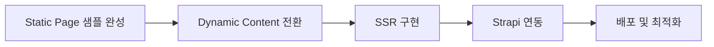

# 사회적협동조합 가치로운 홈페이지 기술 스택 총정리

> **프로젝트**: 사회적협동조합 가치로운 공식 홈페이지  
> **작성일**: 2025-11-16  
> **기술 스택**: Astro + React + Strapi + Cloudflare Pages

---

## 📋 목차

1. [개발 순서 및 전략](#1-개발-순서-및-전략)
2. [기술 스택 및 아키텍처](#2-기술-스택-및-아키텍처)
3. [개발 환경 구성](#3-개발-환경-구성)
4. [운영 환경 (배포)](#4-운영-환경-배포)
5. [환경 변수 관리 (중요)](#5-환경-변수-관리-중요)
6. [Strapi CMS 개발 워크플로우](#6-strapi-cms-개발-워크플로우)
7. [주요 기능 구현](#7-주요-기능-구현)
8. [디자인 시스템](#8-디자인-시스템)
9. [보안 고려사항](#9-보안-고려사항)
10. [주의사항 및 제약사항](#10-주의사항-및-제약사항)

---

## 1. 개발 순서 및 전략



#### Phase 1: Static Page 제작
- **목표**: 디자인 확정 및 레이아웃 구조 완성
- **도구**: Astro + React (인터랙티브 컴포넌트)
- **산출물**: 14개 페이지 HTML/CSS 구현
  - 메인, About, 서비스(3종), 공지사항, 조직소개, 개인정보처리방침, 이용약관 등

#### Phase 2: Dynamic Content 전환
- **전략**: 요청이 온 부분만 동적 페이지로 전환
- **우선순위**:
  1. 공지사항 (Strapi Collection Type)
  2. 인사말 (Strapi Single Type)
  3. 이미지 갤러리 (향후)

#### Phase 3: SSR 구현
- **목적**: SEO 최적화 (검색엔진 크롤링 대응)
- **방식**: Astro SSR + Cloudflare Pages Functions
- **장점**: 
  - 서버에서 완전히 렌더링된 HTML 제공
  - 검색엔진이 JavaScript 실행 없이 컨텐츠 수집 가능

---

## 2. 기술 스택 및 아키텍처

### 2.1 프론트엔드

#### Astro 5.15.4
**선택 이유**:
- SSR 기본 지원 (SEO 친화적)
- 부분 하이드레이션 (성능 최적화)
- 파일 기반 라우팅 (직관적)
- React/Vue/Svelte 등 다양한 프레임워크 통합

**주요 설정** (`astro.config.mjs`):
```javascript
import { defineConfig } from 'astro/config';
import react from '@astrojs/react';
import cloudflare from '@astrojs/cloudflare';

export default defineConfig({
  site: 'https://gachiroun.or.kr',
  output: 'server', // SSR 활성화
  integrations: [react()],
  adapter: cloudflare(),
  vite: {
    ssr: {
      external: ['node:buffer', 'node:path', 'node:fs', 'node:os'],
    },
  },
});
```

#### React 18.3.1
**사용 패턴**:
- 클라이언트 인터랙션이 필요한 컴포넌트만 React로 작성
- `client:load` / `client:visible` 디렉티브로 최적화

**주요 컴포넌트**:
```typescript
// src/components/react/Slider.tsx (메인 배너)
import { useState, useEffect } from 'react';

export function Slider({ slides }) {
  const [current, setCurrent] = useState(0);
  
  useEffect(() => {
    const timer = setInterval(() => {
      setCurrent((prev) => (prev + 1) % slides.length);
    }, 5000);
    return () => clearInterval(timer);
  }, [slides.length]);
  
  return (
    <div className="slider">
      {slides.map((slide, idx) => (
        <div 
          key={idx} 
          className={`slide ${idx === current ? 'active' : ''}`}
        >
          
        </div>
      ))}
    </div>
  );
}
```

### 2.2 백엔드 (Headless CMS)

#### Strapi 5.x (GraphQL + REST API)
**선택 이유**:
- Headless CMS로 컨텐츠와 프론트엔드 완전 분리
- GraphQL + REST API 동시 지원
- 관리자 패널 제공 (비개발자도 컨텐츠 수정 가능)

**컨텐츠 타입**:
1. **Single Types**: 
   - `about.greeting` (인사말)
   - `home.hero` (메인 배너)
2. **Collection Types**:
   - `notices` (공지사항)
   - `events` (행사 일정)

**GraphQL 쿼리 예시**:
```graphql
query GetAnnouncements {
  notices(sort: "publishedAt:desc", pagination: { limit: 10 }) {
    id
    title
    body
    publishedAt
    photo {
      url
      name
      alternativeText
    }
  }
}
```

**Strapi API 클라이언트** (`src/lib/strapi.ts`):
```typescript
// 환경 변수에서 Strapi 설정 가져오기 (로컬/빌드/런타임 모두 지원)
function getStrapiConfig(env?: any) {
  const actualEnv = env || import.meta.env;
  const STRAPI_URL = actualEnv.STRAPI_URL || 'http://localhost:1337';
  const STRAPI_TOKEN = actualEnv.STRAPI_API_TOKEN_READ || '';
  return { STRAPI_URL, STRAPI_TOKEN };
}

async function graphql(query: string, variables?: Record<string, any>, env?: any) {
  const { STRAPI_URL, STRAPI_TOKEN } = getStrapiConfig(env);
  const url = `${STRAPI_URL}/graphql`;

  const res = await fetch(url, {
    method: 'POST',
    headers: {
      'Content-Type': 'application/json',
      ...(STRAPI_TOKEN ? { Authorization: `Bearer ${STRAPI_TOKEN}` } : {}),
    },
    body: JSON.stringify({ query, variables }),
  });

  const payload = await res.json();
  if (payload.errors) throw new Error(JSON.stringify(payload.errors));
  return payload.data;
}

// 공지사항 조회
export async function getAnnouncements(env?: any) {
  const query = `
    query {
      notices(sort: "publishedAt:desc", pagination: { limit: 10 }) {
        id
        title
        body
        publishedAt
        photo { url name alternativeText }
      }
    }
  `;
  const data = await graphql(query, undefined, env);
  return data.notices.map(item => ({
    id: item.id,
    title: item.title,
    body: item.body,
    createdAt: item.publishedAt,
    photo: item.photo?.url || null,
    photoAlt: item.photo?.alternativeText || ''
  }));
}
```

---

## 3. 개발 환경 구성

### 3.1 로컬 개발 환경

#### 필수 소프트웨어
- **Node.js**: v18.x (LTS 버전 권장)
- **npm**: v8.x 이상
- **Astro**: 5.15.4
- **Strapi**: 5.x (로컬에서 GraphQL 테스트용)

#### 폴더 구조
```
/gachiroun-website
├── /public          # 정적 파일 (이미지, 폰트 등)
├── /src
│   ├── /components  # 재사용 가능한 컴포넌트
│   ├── /pages       # 페이지 컴포넌트
│   ├── /layouts      # 레이아웃 컴포넌트
│   ├── /styles       # 전역 스타일
│   └── /lib         # 라이브러리 및 헬퍼 함수
├── package.json
└── astro.config.mjs
```

#### 로컬 개발 서버 실행
1. 의존성 설치: `npm install`
2. Strapi 로컬 서버 실행 (다른 터미널에서): `npm run strapi`
3. Astro 개발 서버 실행: `npm run dev`

#### GraphQL 쿼리 테스트
- **Strapi GraphQL Playground**: `http://localhost:1337/graphql` 에서 쿼리 테스트 가능

---

## 4. 운영 환경 (배포)

### 4.1 Cloudflare Pages 배포

#### 배포 설정
- **프로젝트 연결**: GitHub 레포지토리와 연결
- **빌드 명령**: `npm run build`
- **출력 디렉토리**: `dist`

#### 환경 변수 설정
- **STRAPI_URL**: Strapi API URL (예: `https://api.gachiroun.or.kr`)
- **STRAPI_API_TOKEN_READ**: 읽기 전용 API 토큰

#### 배포 후 확인 사항
1. 배포 상태 확인: Cloudflare Pages 대시보드
2. 도메인 설정: 사용자 도메인 연결 및 SSL 설정
3. 최적화 확인: 이미지 최적화, 캐싱 전략 등

---

## 5. 환경 변수 관리 (중요)

### 5.1 환경 변수 파일

#### `.env` 파일 예시
```
STRAPI_URL=https://api.gachiroun.or.kr
STRAPI_API_TOKEN_READ=your_read_only_token
```

#### 환경 변수 사용 방법
- **서버 사이드**: `import.meta.env`를 통해 접근
- **클라이언트 사이드**: 빌드 타임에 주입된 환경 변수만 사용 가능

### 5.2 보안 고려사항
- **비공개 정보 노출 금지**: `.env` 파일은 절대 공개 리포지토리에 푸시 금지
- **API 토큰 관리**: 필요 최소한의 권한만 부여된 토큰 사용

---

## 6. Strapi CMS 개발 워크플로우

### 6.1 Strapi 설치 및 초기 설정
1. Strapi 프로젝트 생성: `npm create strapi@latest`
2. 관리 패널 접근: `http://localhost:1337/admin`
3. 첫 관리자 계정 생성
4. 기본 설정 완료 후, 필요한 플러그인 설치 (예: GraphQL)

### 6.2 콘텐츠 타입 정의
- **Single Type**: 인사말, 메인 배너 등 단일 콘텐츠
- **Collection Type**: 공지사항, 이벤트 등 목록형 콘텐츠

### 6.3 GraphQL API 테스트
- **GraphQL Playground**: `http://localhost:1337/graphql` 에서 쿼리 테스트
- **예시 쿼리**:
```graphql
query {
  notices(sort: "publishedAt:desc", pagination: { limit: 5 }) {
    id
    title
    body
    publishedAt
  }
}
```

### 6.4 배포 전 확인 사항
- [ ] CORS 설정: 배포 도메인 추가
- [ ] API 토큰 확인: 읽기 전용 토큰 생성 및 비밀 유지
- [ ] 백업: 데이터베이스 및 업로드 파일 백업

---

## 7. 주요 기능 구현

### 7.1 공지사항 기능
- **목적**: 최신 소식 및 공지 전달
- **구현 사항**:
  - 공지사항 목록 페이지
  - 개별 공지사항 상세 페이지
  - 관리자용 공지사항 CRUD 인터페이스

### 7.2 이벤트 일정 기능
- **목적**: 행사 일정 및 정보 제공
- **구현 사항**:
  - 이벤트 목록 페이지
  - 개별 이벤트 상세 페이지
  - 관리자용 이벤트 CRUD 인터페이스

### 7.3 이미지 갤러리 기능
- **목적**: 활동 사진 및 자료 시각적 전달
- **구현 사항**:
  - 갤러리 목록 페이지
  - 이미지 업로드 및 관리 인터페이스
  - Lightbox 뷰어를 통한 이미지 확대 보기

---

## 8. 디자인 시스템

### 8.1 색상 팔레트
- **주 색상**: #0056b3 (진한 파랑)
- **보조 색상**: #f0f0f0 (연한 회색), #333333 (어두운 회색)

### 8.2 타이포그래피
- **기본 글꼴**: Noto Sans KR, sans-serif
- **헤더**: Bold, 24px
- **본문**: Regular, 16px

### 8.3 버튼 스타일
- **기본 버튼**: 배경색 #0056b3, 글자색 #ffffff, 테두리 없음
- **호버 시 효과**: 배경색 #004494

---

## 9. 보안 고려사항

### 9.1 일반 보안 수칙
- **정기적인 패키지 업데이트**: 의존성 패키지 및 서버 소프트웨어 정기 업데이트
- **강력한 비밀번호 정책**: 관리자 및 사용자 비밀번호 강력하게 설정
- **2단계 인증**: 가능하면 2단계 인증 활성화

### 9.2 Strapi 보안 설정
- **CORS 설정**: 배포 도메인만 허용
- **API 토큰 관리**: 비밀 유지 및 정기적 변경
- **파일 업로드 제한**: 업로드 가능한 파일 유형 및 크기 제한

---

## 10. 주의사항 및 제약사항

### 10.1 성능 관련
- **이미지 최적화**: 모든 이미지는 웹 최적화 형식으로 저장 (예: JPEG, PNG)
- **코드 스플리팅**: 페이지별로 필요한 코드만 로드되도록 설정

### 10.2 기능 제한
- **회원 가입/로그인 기능 미포함**: 초기 론칭 시 비회원제 운영
- **댓글/리뷰 기능 미포함**: 추후 필요 시 플러그인 또는 커스텀 개발

### 10.3 기타
- **브라우저 호환성**: 최신 버전의 Chrome, Firefox, Safari에서 최적화 확인
- **모바일 대응**: 반응형 웹 디자인 적용, 주요 모바일 기기에서 테스트

---
